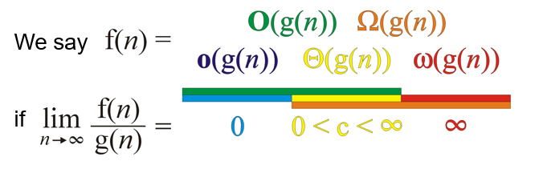
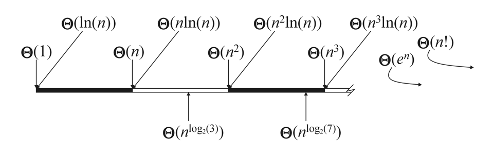
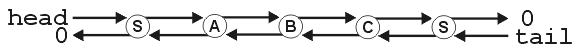

## [ECE 250 - Data Structures & Algorithms](https://ece.uwaterloo.ca/~dwharder/aads/Outline/)
**Course Objectives**

> Introduce the student to the concept of data structures through abstract data structures including lists, sorted lists, stacks, queues, deques, sets/maps, directed acyclic graphs, and graphs; and implementations including the use of linked lists, arrays, binary search trees, M-way search trees, hash tables, complete trees, and adjacency matrices and lists.

> Introduce the student to algorithms design including greedy, divide-and-conquer, random and backtracking algorithms and dynamic programming; and specific algorithms including, for example, resizing arrays, balancing search trees, shortest path, and spanning trees.

---
## Background

Data structures & algorithms govern the way we interact with digital information. At the highest level, they are used to organize and access abstract data types like containers (which store collections of objects).

### Relationships & Orderings
The relationship between objects is often just as important as the information stored in the object. Most data structures can be described using the following six relationships:

- **Linear orderings** - Every object is strictly less than, equal to, or greater than another and vice versa (transitive)
  - *Examples*: Integer & Real Number sets, hexadecimal memory addresses, the alphabet
- **Hierarchical orderings** - Each object has a *parent* object with the exception of a singular *root* object
  - *Examples*: Unix directories, class inheritance in C# and Java
- **Partial orderings** - A hierarchical ordering with 1 or more root and no loops
  - *Examples*: C++ classes (multiple inheritance), compilation dependencies
- **Equivalence relations** - Relationships where objects can be partitioned into subsets (equivalence relations) with other 'weakly' related (x~y) objects
  - *Examples*: Landau symbol *Ө* ```2n ~ 5n ∈ Ө(n)```
- **Weak orderings** - A linear ordering of equivalence classes
  - *Examples*: Big-O notation ```O(1) < O(ln(n)) < O(nln(n))``` 
- **Adjacency Relations** - Relationships described by one object being connected to another (x ↔ y)
  - *Examples*: Graphs, social networks
  
### Asymptotic Analysis & Big-O Notation
It's often useful to analyze and compare algorithms with respect to one or more variables (i.e. run-time, memory). Using the same 'Big O' mathematical notation and Landau symbols used to describe the limiting behaviour of a function, the efficiency of different algorithms can be compared. For two algorithms described by the functions ```f(n)``` and ```g(n)```, the best- and worst-case behaviour of the algorithms  can be described as such (*n* can be a measure of run-time or memory):

<p align="center"></p>

- ```f(n) = o(g(n))``` when ```f(n)``` approaches ∞ at a slower rate than ```g(n)``` (**f outperforms g**)
- ```f(n) = O(g(n))``` when ```f(n)``` approaches ∞ at a rate equal to or slower than ```g(n)``` (**f, at *worst*, performs the same g**)
- ```f(n) = Ω(g(n))``` when ```f(n)``` approaches ∞ at a rate equal to or faster than```g(n)``` 
(**f, at *best*, performs the same g**)
- ```f(n) = ω(g(n))``` when ```f(n)``` approaches ∞ at a much slower rate than ```g(n)``` (**g outperforms f**)
- ```f(n) = Ө(g(n))``` when ```f(n)``` and ```g(n)``` approach ∞ at comparable rates (**f and g perform roughly the same**)

Note that since this notation describes limiting behaviour, one should be wary of making objective statements about the relative performance of two different algorithms without context. For example, even though f may run faster than g for n = 1000000, the opposite could be true when the same algorithms are run on only 1000 objects. Similarly, since Big-O notation gives information about the relative scaling and complexity of different algorithms rather than their absolute performance, for an algorithm f that is faster than another, g, by a constant factor, ```f(n) = Ө(g(n))``` is still true.

After taking these caveats into consideration, Landau symbols prove very useful for describing the complexity of an algorithm. An algorithm is considered to run in *polynomial time* if its run time can be described by ```O(n^d)``` for d greater than or equal to zero. Algorithms with polynomial time complexity are considered efficient in the current non-quantum state of computing, whereas problems that can not be solved in polynomial time are considered intractable or infeasible (e.g. the traveling salesman problem with complexity O(n^22^n) at best). Although these problems could still theoretically be solved, the scaling is computationally inefficient enough that it is typically not worth the effort except for special cases of the problem.

<p align="center"></p>

---
## Linked Lists

Linked lists are the simplest type of data structure, consisting of a set of linearly ordered nodes that, in addition to storing data, also contain an address pointing to the location next node in memory.

- Pros: Simple, O(1) insertions w/out reallocation
- Cons: Inefficient indexing, poor cache locality

### Project 1: [Doubly Linked Sentinel List](1 Doubly Linked List/README.md)
Templated doubly linked list with front and back sentinel nodes

**Project Description:** https://ece.uwaterloo.ca/~dwharder/aads/Projects/1/Double_sentinel_list/



---
## Stacks , Queues, & Deques

The stack data structure are most commonly used as data buffers. Being linearly ordered, stacks are often implemented using a wrapper class around a linked list, and as such retain much of the functionality of a list structure. However, rather than manually traversing the list, member functions for stack/buffer data structures are typically limited to two principal operations that insert (```push```) and remove (```pop```) an object onto/from the stack.

Traditional stacks display last-in-first-out (LIFO) behaviour meaning the first object pushed onto the stack cannot be popped until all of the objects pushed after it have been popped -  like a stack of books. Stacks with a first-in-first-out (FIFO) behaviour are called queues (for reasons that should be self-evident). Apart from the obvious applications (waiting in line at the bank), queues more generally used in client-server models where the server must handle a large number of service requests from clients. Finally, the deque abstract data structure allows an objects to be pushed to the front or the back of the list meaning it can be used as either a queue or a stack.

#### Other Considerations

Despite being a relatively simple data structure, efforts to optimize the efficiency of real-life implementations can be very complicated. For example, stacks and queues can also be implemented efficiently using dynamic arrays. Whereas prepending to a linked list is always O(1), appending elements to an array list is *amortized* O(1) meaning although the total time for n insertions is O(n), the time bound of any individual insertions can be much worse. This is a result of the cost of resizing a full array and reallocating contiguous blocks of memory. Conversely, unlike linked lists which usually require O(n) memory to store pointers in each node, the memory overhead for a dynamic array is typically O(1) (only approaching O(n) after the array capacity is doubled). Other examples of stack-based structure implementations include queues with dynamic array used as a circular buffer and other more esoteric structures like hybrid VLists.

### Project 2: [Resizable Deque](2 Resizable Deque/README.md)
Templated doubly linked list with front and back sentinel nodes

**Project Description:** https://ece.uwaterloo.ca/~dwharder/aads/Projects/2/Resizable_deque/


